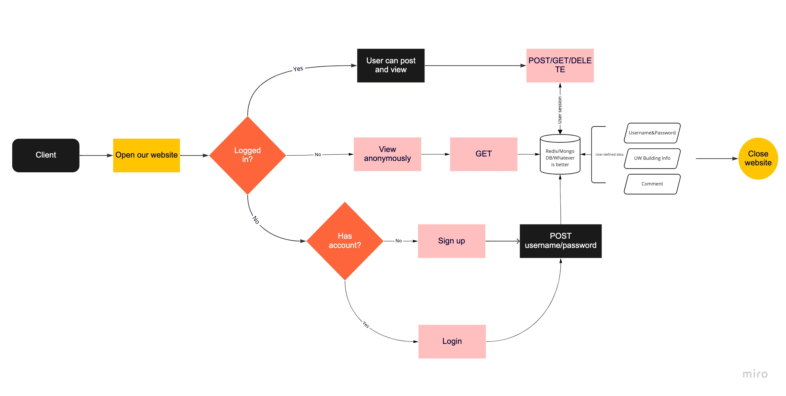

# info441_RateMyUW

Created by: Justin Chen, Lee Shi, Zhengyang Wang and Doris Yang

## Project Description

Our target audience is UW students. Everyone in the UW community can benefit from additional resources about UW life. Additional audiences include staff and faculty members and they are also encouraged to use this app to share their opinions about everything on campus.

Our audience uses our application to view and rate anything related to life at UW. At this moment, we only have applications like Rate My Professor and class rating system. However, college is not only about learning, we also need places to stay as well as attend different social activities. Therefore, a comprehensive platform that can indicate good and bad about places around campus would be desired by us to rate more places like dorms/buildings/restaurants/apartments.

As developers, we are part of the UW community, and we wish to improve the college experience for ourselves and our peers. In addition, we envision many interactive features for the application that can utilize what we learned in the class and improve our programming skills. 

## Technical Description
### Architectural Diagram

## User Stories
| Priority      | User | Description      | Technical Implementation      |
| ----------- | ----------- | ----------- | ----------- |
| P0      | As a user       | I want to know what the residents think about each dorm so that I can have an idea of what dorm is the best option for me       ||
| P0   | As a resident        |I want to share my opinions about dorms I have lived in to help people choose dorms          ||

## Endpoints
/newuser
POST: Sign UP

/user
POST: Sign in

/user/
DELETE: Sign out

/
GET: get the home page

/building 
GET: Gets a list of all buildings 
POST: Add new a new building 

/building/{buildingID}
PATCH: Update building rating data
DELETE: Deletes building rating data
POST: Create a new post for the building
